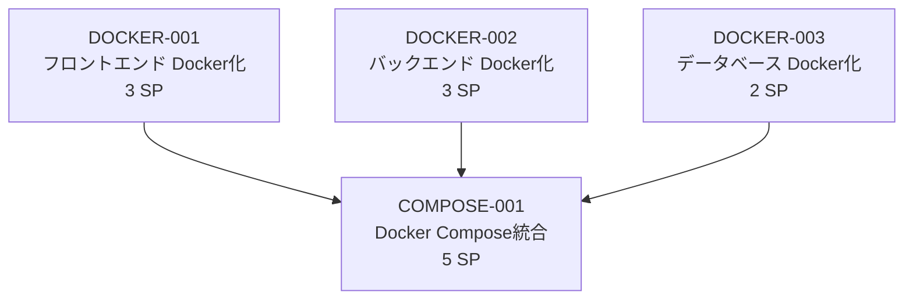

# Sprint 004 プロダクトバックログ

**作成日**: 2025-06-22  
**Sprint期間**: 2025-06-22 - 2025-06-29  
**Sprint目標**: Docker Composeによるワンコマンドアプリケーション起動環境構築  

---

## 📊 Sprint概要

### Story Points合計: 13 Points
### 優先順位と依存関係



---

## 🎯 プロダクトバックログアイテム

### 📋 1. DOCKER-001: フロントエンド Docker化
- **優先度**: High
- **Story Points**: 3
- **担当者**: 開発チーム
- **状況**: 未着手

#### ユーザーストーリー
```
As a 開発者
I want フロントエンドアプリケーションをDockerコンテナで実行したい
So that 環境依存の問題を解消し、統一された開発環境を構築できる
```

#### 主要タスク
- [ ] `frontend/Dockerfile` 作成
- [ ] マルチステージビルド実装（build → nginx）
- [ ] Nginx設定ファイル作成
- [ ] .dockerignore最適化

#### Definition of Done
- [x] Docker buildが成功する
- [x] `docker run`でフロントエンドが起動する
- [x] http://localhost:3000 でアクセス可能
- [x] 静的ファイルが正しく配信される

---

### 📋 2. DOCKER-002: バックエンド Docker化
- **優先度**: High
- **Story Points**: 3
- **担当者**: 開発チーム
- **状況**: 未着手

#### ユーザーストーリー
```
As a 開発者
I want バックエンドAPIをDockerコンテナで実行したい
So that Node.js環境の統一を図り、開発環境のセットアップを簡素化できる
```

#### 主要タスク
- [ ] `backend/Dockerfile` 作成
- [ ] Node.js環境最適化
- [ ] npm install キャッシュ最適化
- [ ] 環境変数適切な管理

#### Definition of Done
- [x] Docker buildが成功する
- [x] `docker run`でバックエンドが起動する
- [x] http://localhost:3001 でAPI応答
- [x] 環境変数が正しく読み込まれる

---

### 📋 3. DOCKER-003: データベース Docker化
- **優先度**: High  
- **Story Points**: 2
- **担当者**: 開発チーム
- **状況**: 未着手

#### ユーザーストーリー
```
As a 開発者
I want データベースをDockerコンテナで実行したい
So that ローカル環境のMySQLインストールを不要にし、一貫したデータベース環境を構築できる
```

#### 主要タスク
- [ ] MySQL公式イメージ設定
- [ ] 初期化SQLスクリプト配置
- [ ] データ永続化ボリューム設定
- [ ] サンプルデータ自動投入

#### Definition of Done
- [x] MySQL コンテナが起動する
- [x] テーブルが自動作成される
- [x] サンプルデータが投入される
- [x] バックエンドから接続可能

---

### 📋 4. COMPOSE-001: Docker Compose統合
- **優先度**: High
- **Story Points**: 5
- **担当者**: 開発チーム
- **状況**: 未着手
- **依存関係**: DOCKER-001, DOCKER-002, DOCKER-003

#### ユーザーストーリー
```
As a 開発者
I want 単一コマンドで全サービスを起動したい
So that 効率的に開発作業を開始し、環境セットアップの時間を短縮できる
```

#### 主要タスク
- [ ] `docker-compose.yml` 作成
- [ ] サービス間ネットワーク設定
- [ ] 依存関係・起動順序設定
- [ ] 環境変数統一管理

#### Definition of Done
- [x] `docker compose up` で全サービス起動
- [x] フロントエンド→バックエンド→データベース連携動作
- [x] ログが適切に出力される
- [x] `docker compose down` で適切に停止

---

## 🏃‍♂️ Sprint実行計画

### Day 1-2: 個別コンテナ化（並行作業）
- **DOCKER-001**: フロントエンド Dockerfile作成・テスト
- **DOCKER-002**: バックエンド Dockerfile作成・テスト  
- **DOCKER-003**: データベース設定・テスト

### Day 3-4: 統合作業
- **COMPOSE-001**: Docker Compose統合・連携テスト

### Day 5: 最終調整・完成
- 総合動作確認・パフォーマンス調整・ドキュメント更新

---

## 🧪 受け入れテスト計画

### 統合テストシナリオ
1. **ワンコマンド起動テスト**
   ```bash
   git pull
   docker compose up -d
   # 期待値: 全サービスが60秒以内に起動
   ```

2. **フル機能動作テスト**
   - フロントエンドアクセス（http://localhost:3000）
   - 繰り返しタスク一覧表示
   - 新規タスク作成・編集・削除

3. **データ永続化テスト**
   ```bash
   docker compose down
   docker compose up -d
   # 期待値: データが保持されている
   ```

### パフォーマンステスト
- **起動時間**: 初回 < 60秒、2回目以降 < 30秒
- **応答時間**: フロントエンド < 2秒、API < 500ms
- **メモリ使用量**: 全体 < 2GB

---

## 🚧 リスク管理

### 技術的リスク
| リスク | 確率 | 影響度 | 対策 |
|--------|------|--------|------|
| Docker環境互換性問題 | Medium | Medium | 複数OS環境でのテスト実施 |
| データベース接続不安定 | High | High | 接続リトライ・ヘルスチェック実装 |
| メモリ不足でのコンテナ停止 | Low | Medium | 軽量イメージ使用・リソース制限設定 |

### スケジュールリスク
| リスク | 確率 | 影響度 | 対策 |
|--------|------|--------|------|
| Docker学習コスト | Low | Low | 基本的な構成に限定・ドキュメント充実 |
| 統合時の予期しない問題 | Medium | Medium | 早期統合・段階的テスト実施 |

---

## 📈 進捗管理

### Daily Stand-up計画
- **毎日9:00**: 進捗確認・ブロッカー解決
- **Burndown Chart**: Story Points消化状況追跡
- **Blocker Log**: 技術的課題・解決策記録

### 完了基準チェックリスト
- [ ] 全Story Points完了（13/13）
- [ ] 受け入れテスト全通過
- [ ] パフォーマンス要件達成
- [ ] ドキュメント更新完了

---

## 🎉 Sprint Review準備

### デモンストレーション準備
1. **環境リセット**: クリーンな状態からの起動デモ
2. **機能デモ**: 繰り返しタスク作成から削除まで
3. **パフォーマンス実演**: 起動時間・応答速度測定

### 成果物確認
- [ ] docker-compose.yml
- [ ] 各サービスのDockerfile（3個）
- [ ] 更新されたREADME.md
- [ ] 動作確認レポート

---

**Product Owner**: 開発チーム  
**Scrum Master**: Claude  
**関連Epic**: CI/CD & Docker化基盤構築  
**次Sprint予定**: ダッシュボード機能強化