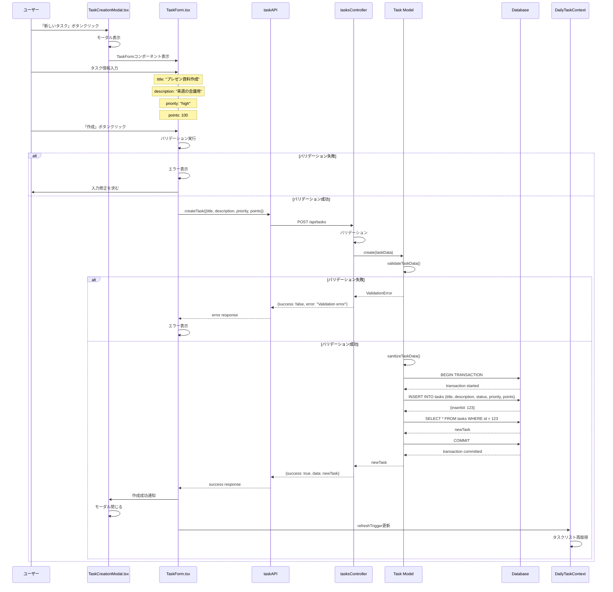
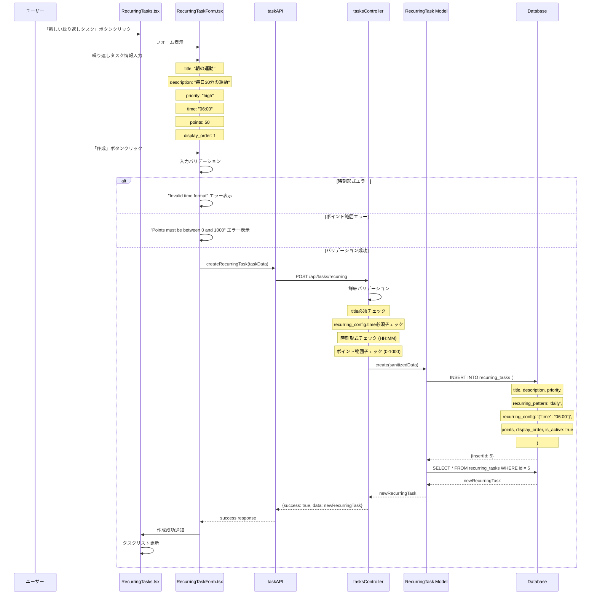
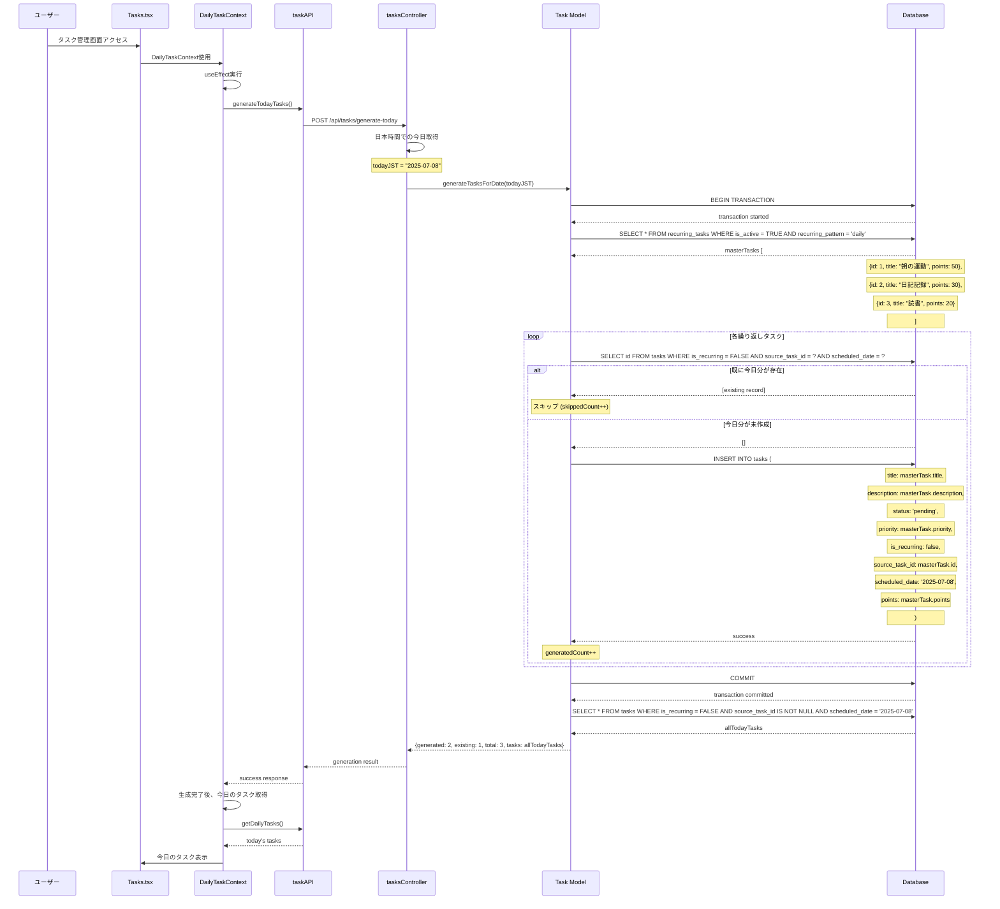
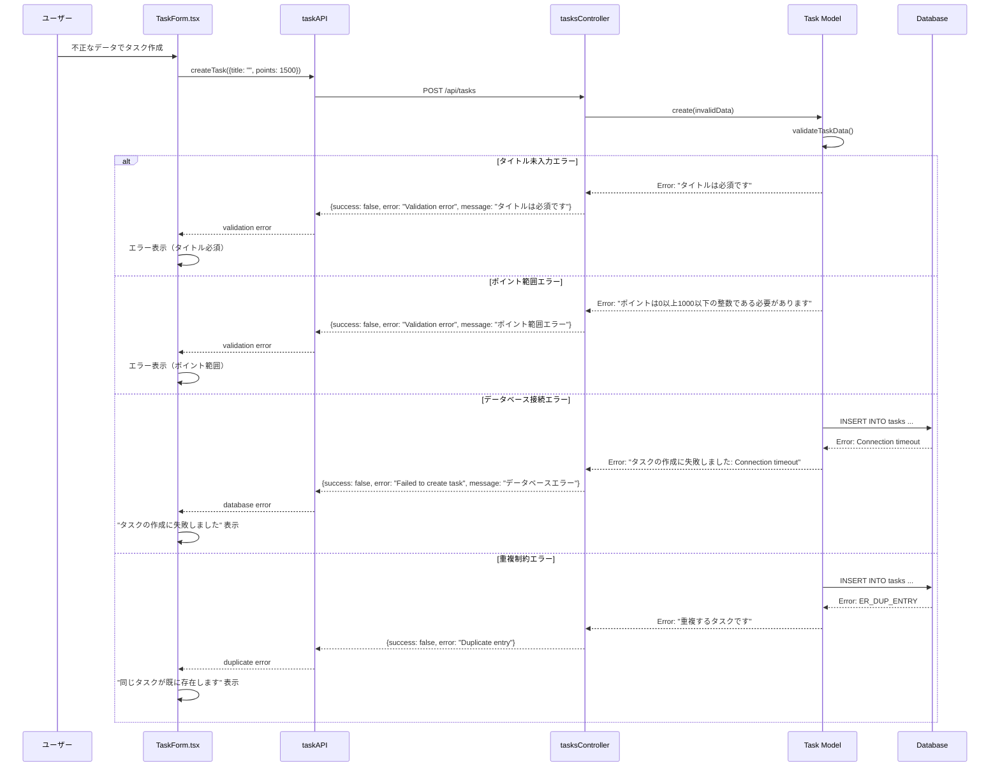
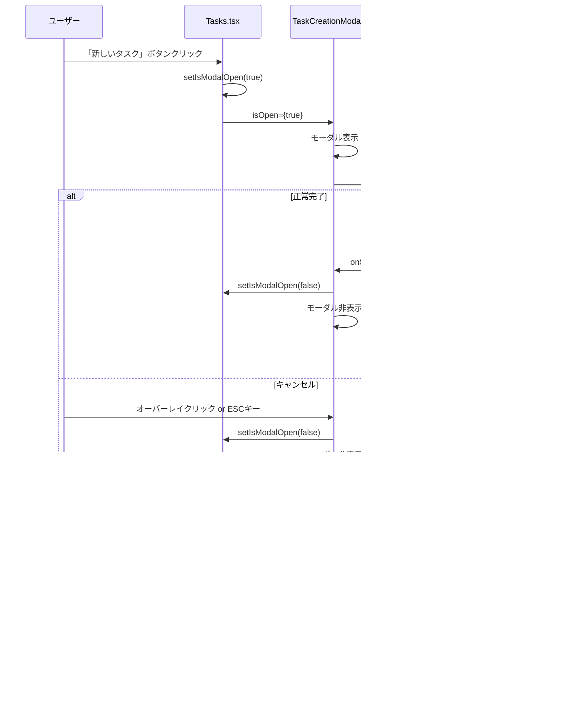
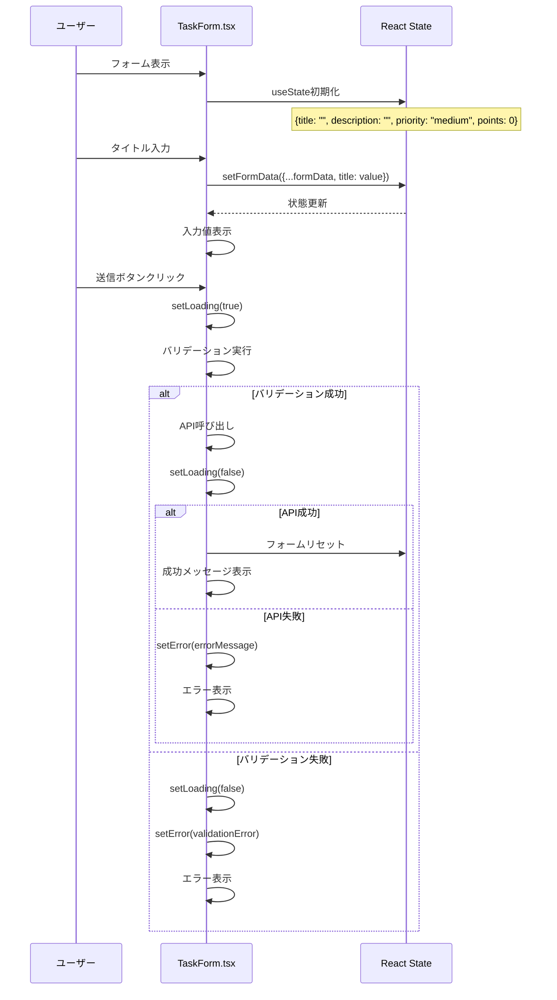

# タスク作成シーケンス図

## 1. 通常タスク作成シーケンス

```mermaid
sequenceDiagram
    participant User as ユーザー
    participant Modal as TaskCreationModal.tsx
    participant Form as TaskForm.tsx
    participant API as taskAPI
    participant Controller as tasksController
    participant TaskModel as Task Model
    participant DB as Database
    participant Context as DailyTaskContext

    User->>Modal: 「新しいタスク」ボタンクリック
    Modal->>Modal: モーダル表示
    Modal->>Form: TaskFormコンポーネント表示
    
    User->>Form: タスク情報入力
    Note over Form: title: "プレゼン資料作成"
    Note over Form: description: "来週の会議用"
    Note over Form: priority: "high"
    Note over Form: points: 100
    
    User->>Form: 「作成」ボタンクリック
    Form->>Form: バリデーション実行
    
    alt バリデーション失敗
        Form->>Form: エラー表示
        Form->>User: 入力修正を求む
    
    else バリデーション成功
        Form->>API: createTask({title, description, priority, points})
        API->>Controller: POST /api/tasks
        
        Controller->>Controller: バリデーション
        Controller->>TaskModel: create(taskData)
        
        TaskModel->>TaskModel: validateTaskData()
        alt バリデーション失敗
            TaskModel-->>Controller: ValidationError
            Controller-->>API: {success: false, error: "Validation error"}
            API-->>Form: error response
            Form->>Form: エラー表示
        
        else バリデーション成功
            TaskModel->>TaskModel: sanitizeTaskData()
            TaskModel->>DB: BEGIN TRANSACTION
            DB-->>TaskModel: transaction started
            
            TaskModel->>DB: INSERT INTO tasks (title, description, status, priority, points)
            DB-->>TaskModel: {insertId: 123}
            
            TaskModel->>DB: SELECT * FROM tasks WHERE id = 123
            DB-->>TaskModel: newTask
            
            TaskModel->>DB: COMMIT
            DB-->>TaskModel: transaction committed
            
            TaskModel-->>Controller: newTask
            Controller-->>API: {success: true, data: newTask}
            API-->>Form: success response
            
            Form->>Modal: 作成成功通知
            Modal->>Modal: モーダル閉じる
            Form->>Context: refreshTrigger更新
            Context->>Context: タスクリスト再取得
        end
    end
```

## 2. 繰り返しタスク作成シーケンス

```mermaid
sequenceDiagram
    participant User as ユーザー
    participant Page as RecurringTasks.tsx
    participant Form as RecurringTaskForm.tsx
    participant API as taskAPI
    participant Controller as tasksController
    participant RecurringModel as RecurringTask Model
    participant DB as Database

    User->>Page: 「新しい繰り返しタスク」ボタンクリック
    Page->>Form: フォーム表示
    
    User->>Form: 繰り返しタスク情報入力
    Note over Form: title: "朝の運動"
    Note over Form: description: "毎日30分の運動"
    Note over Form: priority: "high"
    Note over Form: time: "06:00"
    Note over Form: points: 50
    Note over Form: display_order: 1
    
    User->>Form: 「作成」ボタンクリック
    Form->>Form: 入力バリデーション
    
    alt 時刻形式エラー
        Form->>Form: "Invalid time format" エラー表示
    
    else ポイント範囲エラー
        Form->>Form: "Points must be between 0 and 1000" エラー表示
    
    else バリデーション成功
        Form->>API: createRecurringTask(taskData)
        API->>Controller: POST /api/tasks/recurring
        
        Controller->>Controller: 詳細バリデーション
        Note over Controller: title必須チェック
        Note over Controller: recurring_config.time必須チェック
        Note over Controller: 時刻形式チェック (HH:MM)
        Note over Controller: ポイント範囲チェック (0-1000)
        
        Controller->>RecurringModel: create(sanitizedData)
        
        RecurringModel->>DB: INSERT INTO recurring_tasks (
        Note over DB: title, description, priority, 
        Note over DB: recurring_pattern: 'daily',
        Note over DB: recurring_config: '{"time": "06:00"}',
        Note over DB: points, display_order, is_active: true
        Note over DB: )
        
        DB-->>RecurringModel: {insertId: 5}
        
        RecurringModel->>DB: SELECT * FROM recurring_tasks WHERE id = 5
        DB-->>RecurringModel: newRecurringTask
        
        RecurringModel-->>Controller: newRecurringTask
        Controller-->>API: {success: true, data: newRecurringTask}
        API-->>Form: success response
        
        Form->>Page: 作成成功通知
        Page->>Page: タスクリスト更新
    end
```

## 3. 今日のタスク自動生成（ページアクセス時）

```mermaid
sequenceDiagram
    participant User as ユーザー
    participant Page as Tasks.tsx
    participant Context as DailyTaskContext
    participant API as taskAPI
    participant Controller as tasksController
    participant TaskModel as Task Model
    participant DB as Database

    User->>Page: タスク管理画面アクセス
    Page->>Context: DailyTaskContext使用
    Context->>Context: useEffect実行
    
    Context->>API: generateTodayTasks()
    API->>Controller: POST /api/tasks/generate-today
    
    Controller->>Controller: 日本時間での今日取得
    Note over Controller: todayJST = "2025-07-08"
    
    Controller->>TaskModel: generateTasksForDate(todayJST)
    
    TaskModel->>DB: BEGIN TRANSACTION
    DB-->>TaskModel: transaction started
    
    TaskModel->>DB: SELECT * FROM recurring_tasks WHERE is_active = TRUE AND recurring_pattern = 'daily'
    DB-->>TaskModel: masterTasks [
    Note over DB: {id: 1, title: "朝の運動", points: 50},
    Note over DB: {id: 2, title: "日記記録", points: 30},
    Note over DB: {id: 3, title: "読書", points: 20}
    Note over DB: ]
    
    loop 各繰り返しタスク
        TaskModel->>DB: SELECT id FROM tasks WHERE is_recurring = FALSE AND source_task_id = ? AND scheduled_date = ?
        
        alt 既に今日分が存在
            DB-->>TaskModel: [existing record]
            Note over TaskModel: スキップ (skippedCount++)
        
        else 今日分が未作成
            DB-->>TaskModel: []
            TaskModel->>DB: INSERT INTO tasks (
            Note over DB: title: masterTask.title,
            Note over DB: description: masterTask.description,
            Note over DB: status: 'pending',
            Note over DB: priority: masterTask.priority,
            Note over DB: is_recurring: false,
            Note over DB: source_task_id: masterTask.id,
            Note over DB: scheduled_date: '2025-07-08',
            Note over DB: points: masterTask.points
            Note over DB: )
            DB-->>TaskModel: success
            Note over TaskModel: generatedCount++
        end
    end
    
    TaskModel->>DB: COMMIT
    DB-->>TaskModel: transaction committed
    
    TaskModel->>DB: SELECT * FROM tasks WHERE is_recurring = FALSE AND source_task_id IS NOT NULL AND scheduled_date = '2025-07-08'
    DB-->>TaskModel: allTodayTasks
    
    TaskModel-->>Controller: {generated: 2, existing: 1, total: 3, tasks: allTodayTasks}
    Controller-->>API: generation result
    API-->>Context: success response
    
    Context->>Context: 生成完了後、今日のタスク取得
    Context->>API: getDailyTasks()
    API-->>Context: today's tasks
    Context->>Page: 今日のタスク表示
```

## 4. タスク作成時のエラーハンドリング

```mermaid
sequenceDiagram
    participant User as ユーザー
    participant Form as TaskForm.tsx
    participant API as taskAPI
    participant Controller as tasksController
    participant TaskModel as Task Model
    participant DB as Database

    User->>Form: 不正なデータでタスク作成
    Form->>API: createTask({title: "", points: 1500})
    API->>Controller: POST /api/tasks
    
    Controller->>TaskModel: create(invalidData)
    TaskModel->>TaskModel: validateTaskData()
    
    alt タイトル未入力エラー
        TaskModel-->>Controller: Error: "タイトルは必須です"
        Controller-->>API: {success: false, error: "Validation error", message: "タイトルは必須です"}
        API-->>Form: validation error
        Form->>Form: エラー表示（タイトル必須）
    
    else ポイント範囲エラー
        TaskModel-->>Controller: Error: "ポイントは0以上1000以下の整数である必要があります"
        Controller-->>API: {success: false, error: "Validation error", message: "ポイント範囲エラー"}
        API-->>Form: validation error
        Form->>Form: エラー表示（ポイント範囲）
    
    else データベース接続エラー
        TaskModel->>DB: INSERT INTO tasks ...
        DB-->>TaskModel: Error: Connection timeout
        TaskModel-->>Controller: Error: "タスクの作成に失敗しました: Connection timeout"
        Controller-->>API: {success: false, error: "Failed to create task", message: "データベースエラー"}
        API-->>Form: database error
        Form->>Form: "タスクの作成に失敗しました" 表示
    
    else 重複制約エラー
        TaskModel->>DB: INSERT INTO tasks ...
        DB-->>TaskModel: Error: ER_DUP_ENTRY
        TaskModel-->>Controller: Error: "重複するタスクです"
        Controller-->>API: {success: false, error: "Duplicate entry"}
        API-->>Form: duplicate error
        Form->>Form: "同じタスクが既に存在します" 表示
    end
```

## 5. モーダル管理シーケンス

```mermaid
sequenceDiagram
    participant User as ユーザー
    participant Page as Tasks.tsx
    participant Modal as TaskCreationModal.tsx
    participant Form as TaskForm.tsx

    User->>Page: 「新しいタスク」ボタンクリック
    Page->>Page: setIsModalOpen(true)
    Page->>Modal: isOpen={true}
    Modal->>Modal: モーダル表示
    Modal->>Form: TaskFormマウント
    
    alt 正常完了
        Form->>Form: タスク作成成功
        Form->>Modal: onSuccess()コールバック
        Modal->>Page: setIsModalOpen(false)
        Modal->>Modal: モーダル非表示
        Form->>Form: アンマウント
    
    else キャンセル
        User->>Modal: オーバーレイクリック or ESCキー
        Modal->>Page: setIsModalOpen(false)
        Modal->>Modal: モーダル非表示
        Form->>Form: アンマウント（未保存データ破棄）
    
    else エラー
        Form->>Form: 作成エラー
        Form->>Form: エラー表示（モーダルは開いたまま）
        Note over Form: ユーザーが修正して再試行可能
    end
```

## 6. フォーム状態管理シーケンス

```mermaid
sequenceDiagram
    participant User as ユーザー
    participant Form as TaskForm.tsx
    participant State as React State

    User->>Form: フォーム表示
    Form->>State: useState初期化
    Note over State: {title: "", description: "", priority: "medium", points: 0}
    
    User->>Form: タイトル入力
    Form->>State: setFormData({...formData, title: value})
    State-->>Form: 状態更新
    Form->>Form: 入力値表示
    
    User->>Form: 送信ボタンクリック
    Form->>Form: setLoading(true)
    Form->>Form: バリデーション実行
    
    alt バリデーション成功
        Form->>Form: API呼び出し
        Form->>Form: setLoading(false)
        
        alt API成功
            Form->>State: フォームリセット
            Form->>Form: 成功メッセージ表示
        
        else API失敗
            Form->>Form: setError(errorMessage)
            Form->>Form: エラー表示
        end
    
    else バリデーション失敗
        Form->>Form: setLoading(false)
        Form->>Form: setError(validationError)
        Form->>Form: エラー表示
    end
```