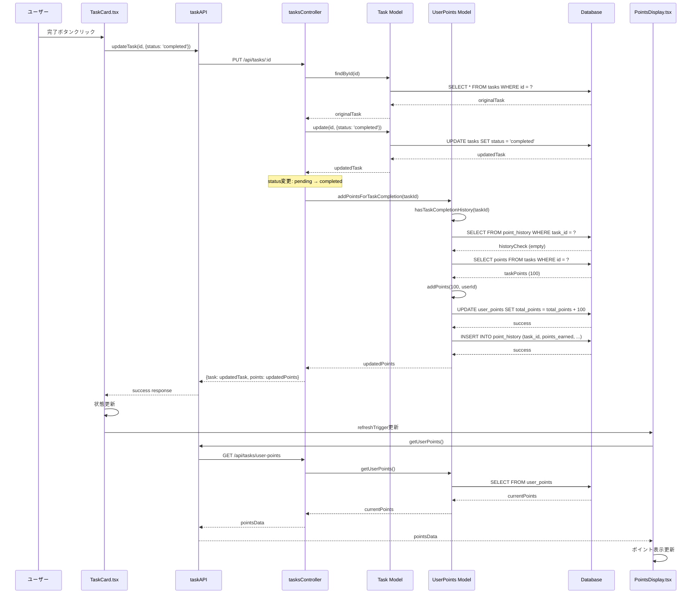
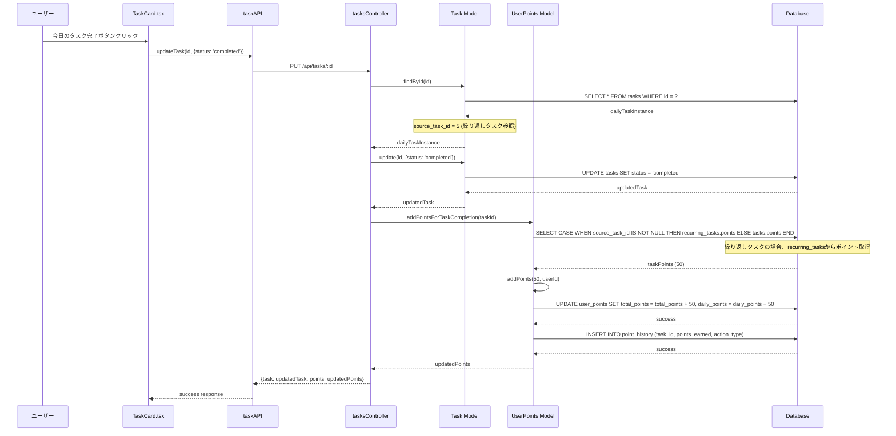
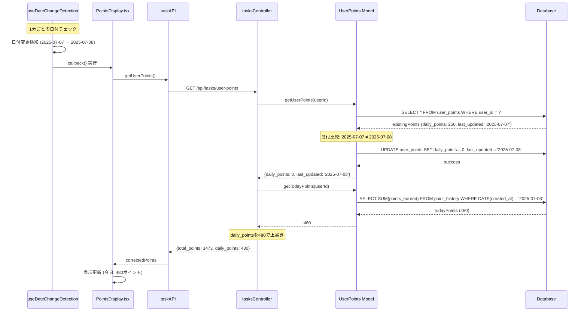
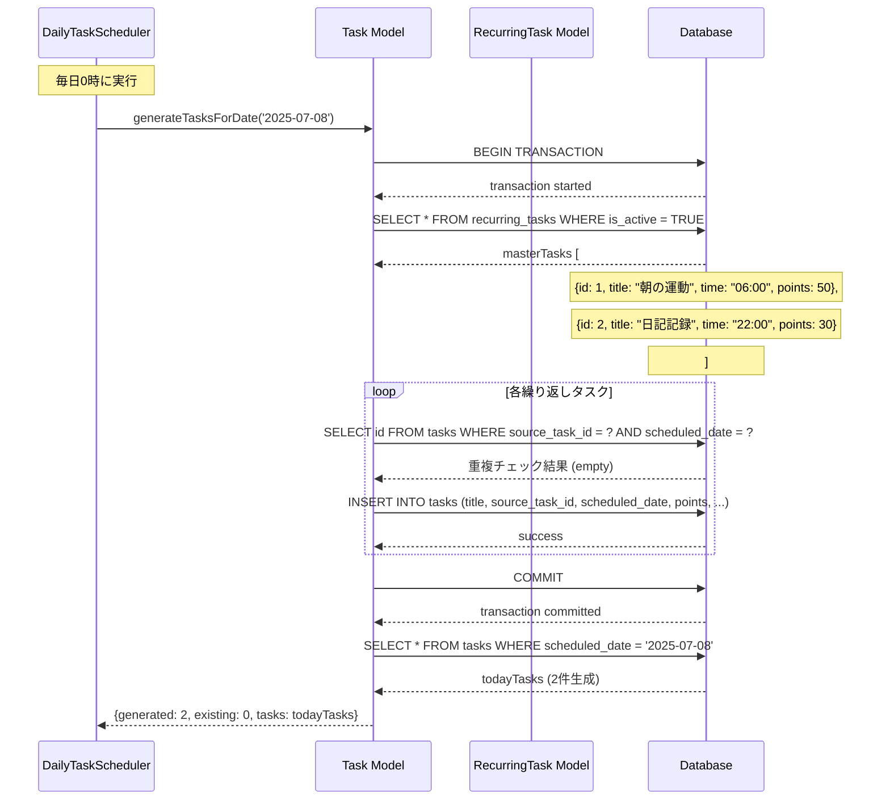
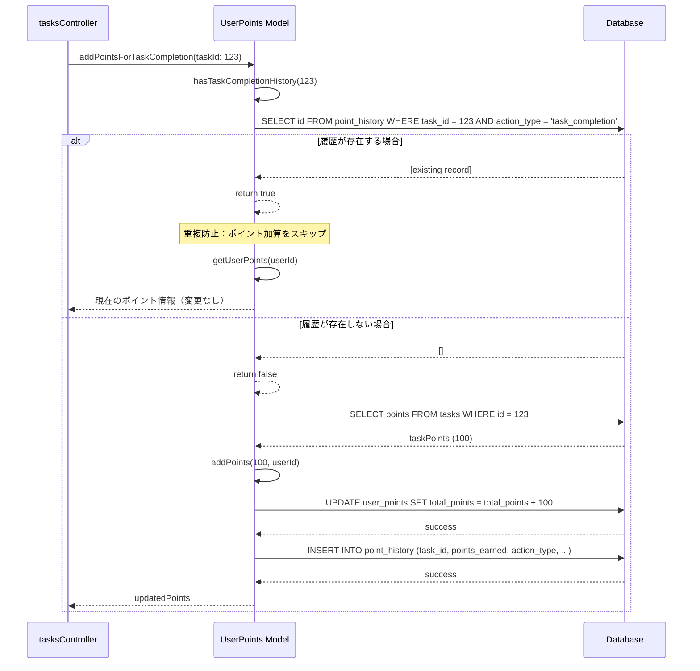
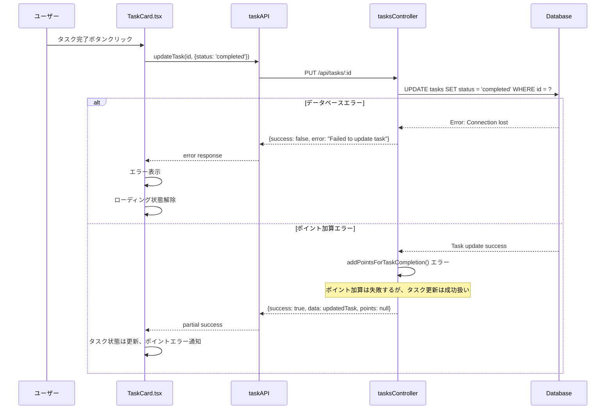

# タスク完了シーケンス図

## 1. 通常タスク完了シーケンス

```mermaid
sequenceDiagram
    participant User as ユーザー
    participant TC as TaskCard.tsx
    participant API as taskAPI
    participant Controller as tasksController
    participant TaskModel as Task Model
    participant PointsModel as UserPoints Model
    participant DB as Database
    participant PD as PointsDisplay.tsx

    User->>TC: 完了ボタンクリック
    TC->>API: updateTask(id, {status: 'completed'})
    API->>Controller: PUT /api/tasks/:id
    
    Controller->>TaskModel: findById(id)
    TaskModel->>DB: SELECT * FROM tasks WHERE id = ?
    DB-->>TaskModel: originalTask
    TaskModel-->>Controller: originalTask
    
    Controller->>TaskModel: update(id, {status: 'completed'})
    TaskModel->>DB: UPDATE tasks SET status = 'completed'
    DB-->>TaskModel: updatedTask
    TaskModel-->>Controller: updatedTask
    
    Note over Controller: status変更: pending → completed
    
    Controller->>PointsModel: addPointsForTaskCompletion(taskId)
    
    PointsModel->>PointsModel: hasTaskCompletionHistory(taskId)
    PointsModel->>DB: SELECT FROM point_history WHERE task_id = ?
    DB-->>PointsModel: historyCheck (empty)
    
    PointsModel->>DB: SELECT points FROM tasks WHERE id = ?
    DB-->>PointsModel: taskPoints (100)
    
    PointsModel->>PointsModel: addPoints(100, userId)
    PointsModel->>DB: UPDATE user_points SET total_points = total_points + 100
    DB-->>PointsModel: success
    
    PointsModel->>DB: INSERT INTO point_history (task_id, points_earned, ...)
    DB-->>PointsModel: success
    
    PointsModel-->>Controller: updatedPoints
    Controller-->>API: {task: updatedTask, points: updatedPoints}
    API-->>TC: success response
    
    TC->>TC: 状態更新
    TC->>PD: refreshTrigger更新
    PD->>API: getUserPoints()
    API->>Controller: GET /api/tasks/user-points
    Controller->>PointsModel: getUserPoints()
    PointsModel->>DB: SELECT FROM user_points
    DB-->>PointsModel: currentPoints
    PointsModel-->>Controller: currentPoints
    Controller-->>API: pointsData
    API-->>PD: pointsData
    PD->>PD: ポイント表示更新
```

## 2. 繰り返しタスク（今日のタスク）完了シーケンス

```mermaid
sequenceDiagram
    participant User as ユーザー
    participant TC as TaskCard.tsx
    participant API as taskAPI
    participant Controller as tasksController
    participant TaskModel as Task Model
    participant PointsModel as UserPoints Model
    participant DB as Database

    User->>TC: 今日のタスク完了ボタンクリック
    TC->>API: updateTask(id, {status: 'completed'})
    API->>Controller: PUT /api/tasks/:id
    
    Controller->>TaskModel: findById(id)
    TaskModel->>DB: SELECT * FROM tasks WHERE id = ?
    DB-->>TaskModel: dailyTaskInstance
    Note over TaskModel: source_task_id = 5 (繰り返しタスク参照)
    TaskModel-->>Controller: dailyTaskInstance
    
    Controller->>TaskModel: update(id, {status: 'completed'})
    TaskModel->>DB: UPDATE tasks SET status = 'completed'
    DB-->>TaskModel: updatedTask
    TaskModel-->>Controller: updatedTask
    
    Controller->>PointsModel: addPointsForTaskCompletion(taskId)
    
    PointsModel->>DB: SELECT CASE WHEN source_task_id IS NOT NULL THEN recurring_tasks.points ELSE tasks.points END
    Note over DB: 繰り返しタスクの場合、recurring_tasksからポイント取得
    DB-->>PointsModel: taskPoints (50)
    
    PointsModel->>PointsModel: addPoints(50, userId)
    PointsModel->>DB: UPDATE user_points SET total_points = total_points + 50, daily_points = daily_points + 50
    DB-->>PointsModel: success
    
    PointsModel->>DB: INSERT INTO point_history (task_id, points_earned, action_type)
    DB-->>PointsModel: success
    
    PointsModel-->>Controller: updatedPoints
    Controller-->>API: {task: updatedTask, points: updatedPoints}
    API-->>TC: success response
```

## 3. 日付変更時のポイントリセットシーケンス

```mermaid
sequenceDiagram
    participant Hook as useDateChangeDetection
    participant PD as PointsDisplay.tsx
    participant API as taskAPI
    participant Controller as tasksController
    participant PointsModel as UserPoints Model
    participant DB as Database

    Note over Hook: 1分ごとの日付チェック
    Hook->>Hook: 日付変更検知 (2025-07-07 → 2025-07-08)
    Hook->>PD: callback() 実行
    
    PD->>API: getUserPoints()
    API->>Controller: GET /api/tasks/user-points
    
    Controller->>PointsModel: getUserPoints(userId)
    PointsModel->>DB: SELECT * FROM user_points WHERE user_id = ?
    DB-->>PointsModel: existingPoints {daily_points: 250, last_updated: '2025-07-07'}
    
    Note over PointsModel: 日付比較: 2025-07-07 ≠ 2025-07-08
    
    PointsModel->>DB: UPDATE user_points SET daily_points = 0, last_updated = '2025-07-08'
    DB-->>PointsModel: success
    
    PointsModel-->>Controller: {daily_points: 0, last_updated: '2025-07-08'}
    
    Controller->>PointsModel: getTodayPoints(userId)
    PointsModel->>DB: SELECT SUM(points_earned) FROM point_history WHERE DATE(created_at) = '2025-07-08'
    DB-->>PointsModel: todayPoints (480)
    PointsModel-->>Controller: 480
    
    Note over Controller: daily_pointsを480で上書き
    
    Controller-->>API: {total_points: 3473, daily_points: 480}
    API-->>PD: correctedPoints
    PD->>PD: 表示更新 (今日: 480ポイント)
```

## 4. 今日のタスク自動生成シーケンス

```mermaid
sequenceDiagram
    participant Scheduler as DailyTaskScheduler
    participant TaskModel as Task Model
    participant RecurringModel as RecurringTask Model
    participant DB as Database

    Note over Scheduler: 毎日0時に実行
    Scheduler->>TaskModel: generateTasksForDate('2025-07-08')
    
    TaskModel->>DB: BEGIN TRANSACTION
    DB-->>TaskModel: transaction started
    
    TaskModel->>DB: SELECT * FROM recurring_tasks WHERE is_active = TRUE
    DB-->>TaskModel: masterTasks [
    Note over DB: {id: 1, title: "朝の運動", time: "06:00", points: 50},
    Note over DB: {id: 2, title: "日記記録", time: "22:00", points: 30}
    Note over DB: ]
    
    loop 各繰り返しタスク
        TaskModel->>DB: SELECT id FROM tasks WHERE source_task_id = ? AND scheduled_date = ?
        DB-->>TaskModel: 重複チェック結果 (empty)
        
        TaskModel->>DB: INSERT INTO tasks (title, source_task_id, scheduled_date, points, ...)
        DB-->>TaskModel: success
    end
    
    TaskModel->>DB: COMMIT
    DB-->>TaskModel: transaction committed
    
    TaskModel->>DB: SELECT * FROM tasks WHERE scheduled_date = '2025-07-08'
    DB-->>TaskModel: todayTasks (2件生成)
    
    TaskModel-->>Scheduler: {generated: 2, existing: 0, tasks: todayTasks}
```

## 5. ポイント履歴確認・重複防止シーケンス

```mermaid
sequenceDiagram
    participant Controller as tasksController
    participant PointsModel as UserPoints Model
    participant DB as Database

    Controller->>PointsModel: addPointsForTaskCompletion(taskId: 123)
    
    PointsModel->>PointsModel: hasTaskCompletionHistory(123)
    PointsModel->>DB: SELECT id FROM point_history WHERE task_id = 123 AND action_type = 'task_completion'
    
    alt 履歴が存在する場合
        DB-->>PointsModel: [existing record]
        PointsModel-->>PointsModel: return true
        Note over PointsModel: 重複防止：ポイント加算をスキップ
        PointsModel->>PointsModel: getUserPoints(userId)
        PointsModel-->>Controller: 現在のポイント情報（変更なし）
    
    else 履歴が存在しない場合
        DB-->>PointsModel: []
        PointsModel-->>PointsModel: return false
        
        PointsModel->>DB: SELECT points FROM tasks WHERE id = 123
        DB-->>PointsModel: taskPoints (100)
        
        PointsModel->>PointsModel: addPoints(100, userId)
        PointsModel->>DB: UPDATE user_points SET total_points = total_points + 100
        DB-->>PointsModel: success
        
        PointsModel->>DB: INSERT INTO point_history (task_id, points_earned, action_type, ...)
        DB-->>PointsModel: success
        
        PointsModel-->>Controller: updatedPoints
    end
```

## 6. エラーハンドリングシーケンス

```mermaid
sequenceDiagram
    participant User as ユーザー
    participant TC as TaskCard.tsx
    participant API as taskAPI
    participant Controller as tasksController
    participant DB as Database

    User->>TC: タスク完了ボタンクリック
    TC->>API: updateTask(id, {status: 'completed'})
    API->>Controller: PUT /api/tasks/:id
    
    Controller->>DB: UPDATE tasks SET status = 'completed' WHERE id = ?
    
    alt データベースエラー
        DB-->>Controller: Error: Connection lost
        Controller-->>API: {success: false, error: "Failed to update task"}
        API-->>TC: error response
        TC->>TC: エラー表示
        TC->>TC: ローディング状態解除
    
    else ポイント加算エラー
        DB-->>Controller: Task update success
        Controller->>Controller: addPointsForTaskCompletion() エラー
        Note over Controller: ポイント加算は失敗するが、タスク更新は成功扱い
        Controller-->>API: {success: true, data: updatedTask, points: null}
        API-->>TC: partial success
        TC->>TC: タスク状態は更新、ポイントエラー通知
    end
```