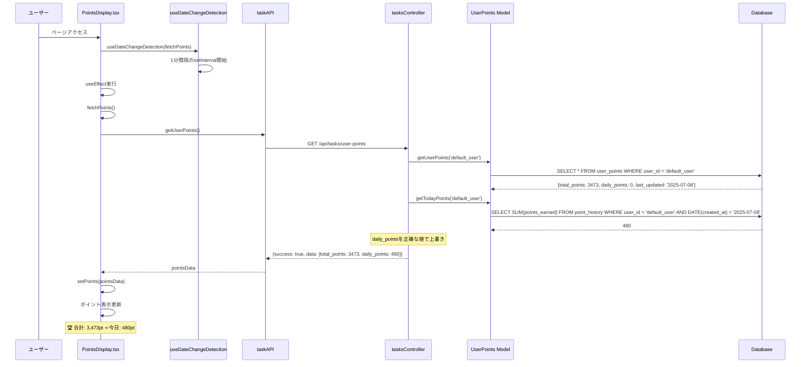
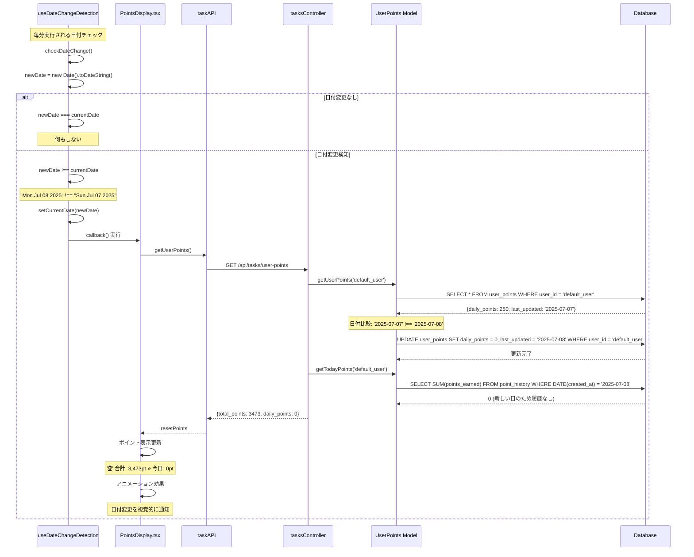
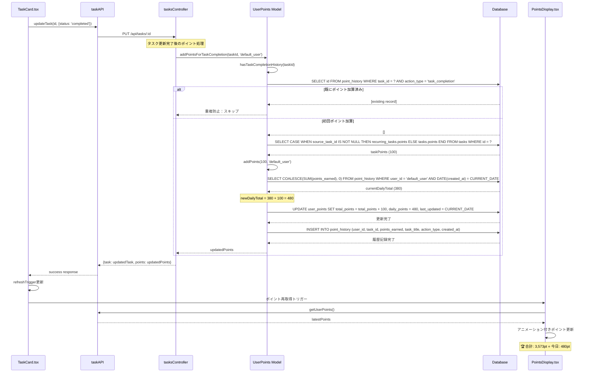
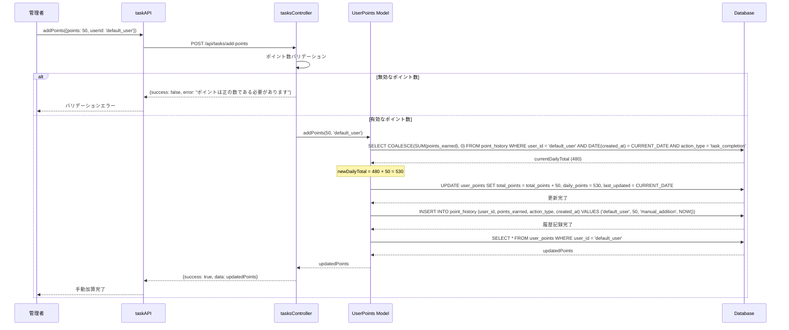
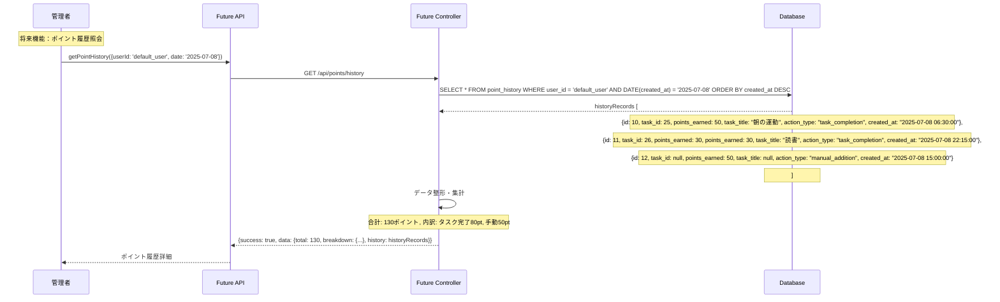
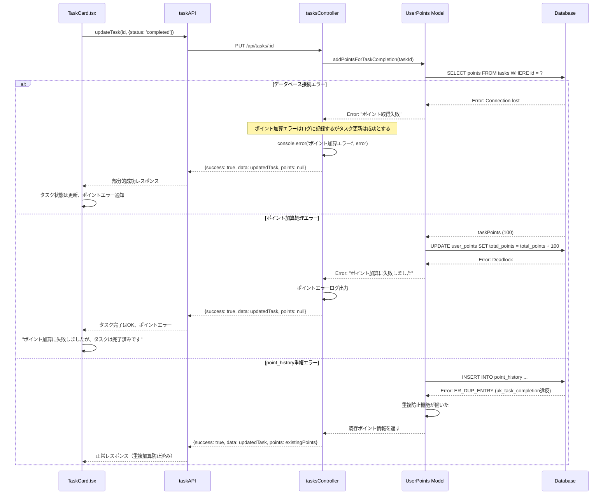

# ポイント管理シーケンス図

## 1. ポイント表示・更新シーケンス

```mermaid
sequenceDiagram
    participant User as ユーザー
    participant PD as PointsDisplay.tsx
    participant Hook as useDateChangeDetection
    participant API as taskAPI
    participant Controller as tasksController
    participant PointsModel as UserPoints Model
    participant DB as Database

    User->>PD: ページアクセス
    PD->>Hook: useDateChangeDetection(fetchPoints)
    Hook->>Hook: 1分間隔のsetInterval開始
    
    PD->>PD: useEffect実行
    PD->>PD: fetchPoints()
    
    PD->>API: getUserPoints()
    API->>Controller: GET /api/tasks/user-points
    
    Controller->>PointsModel: getUserPoints('default_user')
    PointsModel->>DB: SELECT * FROM user_points WHERE user_id = 'default_user'
    DB-->>PointsModel: {total_points: 3473, daily_points: 0, last_updated: '2025-07-08'}
    
    Controller->>PointsModel: getTodayPoints('default_user')
    PointsModel->>DB: SELECT SUM(points_earned) FROM point_history WHERE user_id = 'default_user' AND DATE(created_at) = '2025-07-08'
    DB-->>PointsModel: 480
    
    Note over Controller: daily_pointsを正確な値で上書き
    
    Controller-->>API: {success: true, data: {total_points: 3473, daily_points: 480}}
    API-->>PD: pointsData
    
    PD->>PD: setPoints(pointsData)
    PD->>PD: ポイント表示更新
    Note over PD: 🏆 合計: 3,473pt  ⭐ 今日: 480pt
```

## 2. 日付変更検知・ポイントリセットシーケンス

```mermaid
sequenceDiagram
    participant Hook as useDateChangeDetection
    participant PD as PointsDisplay.tsx
    participant API as taskAPI
    participant Controller as tasksController
    participant PointsModel as UserPoints Model
    participant DB as Database

    Note over Hook: 毎分実行される日付チェック
    Hook->>Hook: checkDateChange()
    Hook->>Hook: newDate = new Date().toDateString()
    
    alt 日付変更なし
        Hook->>Hook: newDate === currentDate
        Note over Hook: 何もしない
    
    else 日付変更検知
        Hook->>Hook: newDate !== currentDate
        Note over Hook: "Mon Jul 08 2025" !== "Sun Jul 07 2025"
        
        Hook->>Hook: setCurrentDate(newDate)
        Hook->>PD: callback() 実行
        
        PD->>API: getUserPoints()
        API->>Controller: GET /api/tasks/user-points
        
        Controller->>PointsModel: getUserPoints('default_user')
        PointsModel->>DB: SELECT * FROM user_points WHERE user_id = 'default_user'
        DB-->>PointsModel: {daily_points: 250, last_updated: '2025-07-07'}
        
        Note over PointsModel: 日付比較: '2025-07-07' !== '2025-07-08'
        
        PointsModel->>DB: UPDATE user_points SET daily_points = 0, last_updated = '2025-07-08' WHERE user_id = 'default_user'
        DB-->>PointsModel: 更新完了
        
        Controller->>PointsModel: getTodayPoints('default_user')
        PointsModel->>DB: SELECT SUM(points_earned) FROM point_history WHERE DATE(created_at) = '2025-07-08'
        DB-->>PointsModel: 0 (新しい日のため履歴なし)
        
        Controller-->>API: {total_points: 3473, daily_points: 0}
        API-->>PD: resetPoints
        
        PD->>PD: ポイント表示更新
        Note over PD: 🏆 合計: 3,473pt  ⭐ 今日: 0pt
        
        PD->>PD: アニメーション効果
        Note over PD: 日付変更を視覚的に通知
    end
```

## 3. タスク完了時のポイント加算シーケンス

```mermaid
sequenceDiagram
    participant TaskCard as TaskCard.tsx
    participant API as taskAPI
    participant Controller as tasksController
    participant PointsModel as UserPoints Model
    participant DB as Database
    participant PD as PointsDisplay.tsx

    TaskCard->>API: updateTask(id, {status: 'completed'})
    API->>Controller: PUT /api/tasks/:id
    
    Note over Controller: タスク更新完了後のポイント処理
    
    Controller->>PointsModel: addPointsForTaskCompletion(taskId, 'default_user')
    
    PointsModel->>PointsModel: hasTaskCompletionHistory(taskId)
    PointsModel->>DB: SELECT id FROM point_history WHERE task_id = ? AND action_type = 'task_completion'
    
    alt 既にポイント加算済み
        DB-->>PointsModel: [existing record]
        PointsModel-->>Controller: 重複防止：スキップ
        
    else 初回ポイント加算
        DB-->>PointsModel: []
        
        PointsModel->>DB: SELECT CASE WHEN source_task_id IS NOT NULL THEN recurring_tasks.points ELSE tasks.points END FROM tasks WHERE id = ?
        DB-->>PointsModel: taskPoints (100)
        
        PointsModel->>PointsModel: addPoints(100, 'default_user')
        
        PointsModel->>DB: SELECT COALESCE(SUM(points_earned), 0) FROM point_history WHERE user_id = 'default_user' AND DATE(created_at) = CURRENT_DATE
        DB-->>PointsModel: currentDailyTotal (380)
        
        Note over PointsModel: newDailyTotal = 380 + 100 = 480
        
        PointsModel->>DB: UPDATE user_points SET total_points = total_points + 100, daily_points = 480, last_updated = CURRENT_DATE
        DB-->>PointsModel: 更新完了
        
        PointsModel->>DB: INSERT INTO point_history (user_id, task_id, points_earned, task_title, action_type, created_at)
        DB-->>PointsModel: 履歴記録完了
        
        PointsModel-->>Controller: updatedPoints
    end
    
    Controller-->>API: {task: updatedTask, points: updatedPoints}
    API-->>TaskCard: success response
    
    TaskCard->>TaskCard: refreshTrigger更新
    TaskCard->>PD: ポイント再取得トリガー
    
    PD->>API: getUserPoints()
    API-->>PD: latestPoints
    PD->>PD: アニメーション付きポイント更新
    Note over PD: 🏆 合計: 3,573pt  ⭐ 今日: 480pt
```

## 4. 手動ポイント加算シーケンス

```mermaid
sequenceDiagram
    participant Admin as 管理者
    participant API as taskAPI
    participant Controller as tasksController
    participant PointsModel as UserPoints Model
    participant DB as Database

    Admin->>API: addPoints({points: 50, userId: 'default_user'})
    API->>Controller: POST /api/tasks/add-points
    
    Controller->>Controller: ポイント数バリデーション
    alt 無効なポイント数
        Controller-->>API: {success: false, error: "ポイントは正の数である必要があります"}
        API-->>Admin: バリデーションエラー
    
    else 有効なポイント数
        Controller->>PointsModel: addPoints(50, 'default_user')
        
        PointsModel->>DB: SELECT COALESCE(SUM(points_earned), 0) FROM point_history WHERE user_id = 'default_user' AND DATE(created_at) = CURRENT_DATE AND action_type = 'task_completion'
        DB-->>PointsModel: currentDailyTotal (480)
        
        Note over PointsModel: newDailyTotal = 480 + 50 = 530
        
        PointsModel->>DB: UPDATE user_points SET total_points = total_points + 50, daily_points = 530, last_updated = CURRENT_DATE
        DB-->>PointsModel: 更新完了
        
        PointsModel->>DB: INSERT INTO point_history (user_id, points_earned, action_type, created_at) VALUES ('default_user', 50, 'manual_addition', NOW())
        DB-->>PointsModel: 履歴記録完了
        
        PointsModel->>DB: SELECT * FROM user_points WHERE user_id = 'default_user'
        DB-->>PointsModel: updatedPoints
        
        PointsModel-->>Controller: updatedPoints
        Controller-->>API: {success: true, data: updatedPoints}
        API-->>Admin: 手動加算完了
    end
```

## 5. ポイント履歴照会シーケンス

```mermaid
sequenceDiagram
    participant Admin as 管理者
    participant API as Future API
    participant Controller as Future Controller
    participant DB as Database

    Note over Admin: 将来機能：ポイント履歴照会
    
    Admin->>API: getPointHistory({userId: 'default_user', date: '2025-07-08'})
    API->>Controller: GET /api/points/history
    
    Controller->>DB: SELECT * FROM point_history WHERE user_id = 'default_user' AND DATE(created_at) = '2025-07-08' ORDER BY created_at DESC
    
    DB-->>Controller: historyRecords [
    Note over DB: {id: 10, task_id: 25, points_earned: 50, task_title: "朝の運動", action_type: "task_completion", created_at: "2025-07-08 06:30:00"},
    Note over DB: {id: 11, task_id: 26, points_earned: 30, points_earned: 30, task_title: "読書", action_type: "task_completion", created_at: "2025-07-08 22:15:00"},
    Note over DB: {id: 12, task_id: null, points_earned: 50, task_title: null, action_type: "manual_addition", created_at: "2025-07-08 15:00:00"}
    Note over DB: ]
    
    Controller->>Controller: データ整形・集計
    Note over Controller: 合計: 130ポイント, 内訳: タスク完了80pt, 手動50pt
    
    Controller-->>API: {success: true, data: {total: 130, breakdown: {...}, history: historyRecords}}
    API-->>Admin: ポイント履歴詳細
```

## 6. エラーハンドリング（ポイント系）

```mermaid
sequenceDiagram
    participant TaskCard as TaskCard.tsx
    participant API as taskAPI
    participant Controller as tasksController
    participant PointsModel as UserPoints Model
    participant DB as Database

    TaskCard->>API: updateTask(id, {status: 'completed'})
    API->>Controller: PUT /api/tasks/:id
    
    Controller->>PointsModel: addPointsForTaskCompletion(taskId)
    
    PointsModel->>DB: SELECT points FROM tasks WHERE id = ?
    
    alt データベース接続エラー
        DB-->>PointsModel: Error: Connection lost
        PointsModel-->>Controller: Error: "ポイント取得失敗"
        
        Note over Controller: ポイント加算エラーはログに記録するがタスク更新は成功とする
        Controller->>Controller: console.error('ポイント加算エラー:', error)
        Controller-->>API: {success: true, data: updatedTask, points: null}
        API-->>TaskCard: 部分的成功レスポンス
        
        TaskCard->>TaskCard: タスク状態は更新、ポイントエラー通知
    
    else ポイント加算処理エラー
        DB-->>PointsModel: taskPoints (100)
        PointsModel->>DB: UPDATE user_points SET total_points = total_points + 100
        DB-->>PointsModel: Error: Deadlock
        
        PointsModel-->>Controller: Error: "ポイント加算に失敗しました"
        Controller->>Controller: ポイントエラーログ出力
        Controller-->>API: {success: true, data: updatedTask, points: null}
        API-->>TaskCard: タスク完了はOK、ポイントエラー
        
        TaskCard->>TaskCard: "ポイント加算に失敗しましたが、タスクは完了済みです"
    
    else point_history重複エラー
        PointsModel->>DB: INSERT INTO point_history ...
        DB-->>PointsModel: Error: ER_DUP_ENTRY (uk_task_completion違反)
        
        PointsModel->>PointsModel: 重複防止機能が働いた
        PointsModel-->>Controller: 既存ポイント情報を返す
        Controller-->>API: {success: true, data: updatedTask, points: existingPoints}
        API-->>TaskCard: 正常レスポンス（重複加算防止済み）
    end
```